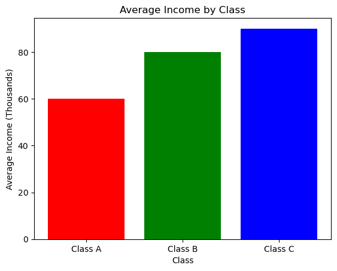
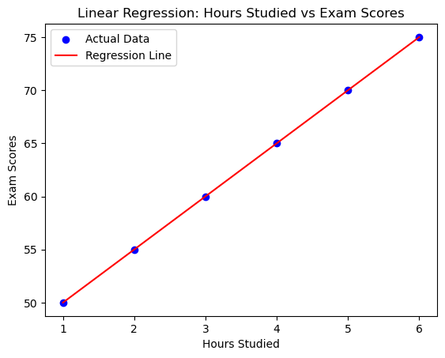

## **Lecture 1: Introduction to Probability and Statistics**

### **Subtopic 1: What is Probability and Statistics?**

#### **Role of Probability and Statistics in AI**
**Explanation:**
- **Probability** and **Statistics** are essential tools in **Artificial Intelligence (AI)** for **making predictions** and **decisions** based on **data**.
- **Probability** helps AI systems make decisions under uncertainty. It is used to model the likelihood of various events.
- **Statistics** helps AI systems analyze and interpret large datasets, draw conclusions from data, and make **inferences** about the underlying population.

**Real-World Example:**
- **Spam Filter** in email systems:
  - Probability is used to determine the likelihood that an email is **spam** based on various features (e.g., subject line, sender).
  - Statistics help analyze past email data to refine the spam filter’s predictions.

#### **Basic Definitions**
1. **Probability**: The likelihood or chance of an event happening.
   - **Formula for Probability**:

     
     
2. **Events**: A specific outcome or combination of outcomes from an experiment.
3. **Random Variables**: Variables whose values are determined by random events.
   - **Discrete Random Variables**: Can take specific, countable values (e.g., the number of heads in 10 coin flips).
   - **Continuous Random Variables**: Can take any value within a range (e.g., height or weight).

**Real-World Scenario:**
- Imagine a **weather forecasting system** predicting rain based on various inputs (e.g., temperature, humidity, pressure). **Probability** models the likelihood of rain, while **statistics** helps improve the accuracy of these predictions based on historical weather data.
- Imagine a car approaching an intersection. It must decide whether to slow down or stop based on sensor inputs. These sensors may detect various objects with a certain probability (e.g., a 95% chance that an object is a pedestrian). The AI uses this information to determine the safest action.  

---

### **Subtopic 2: Basic Terminology**

#### **Discrete vs. Continuous Random Variables**
**Discrete Random Variables**:
- These variables can only take **specific values**. Examples include counts like the number of heads in a coin flip or the number of cars in a parking lot.
  
**Formula for Discrete Random Variables**:
- For a discrete random variable \( X \), the probability mass function \( P(X=x) \) gives the probability for each value of \( X \).

**Example:**
- Number of heads in 3 coin flips: It can take values in \( \{0, 1, 2, 3\} \).


```python
import numpy as np
# Simulate 3 coin flips
coin_flips = np.random.randint(0, 2, size=3)  # 0 = Tails, 1 = Heads
num_heads = np.sum(coin_flips)  # Count number of heads
print(f"Coin flips result: {coin_flips}")
print(f"Number of heads: {num_heads}")

```

    Coin flips result: [1 1 1]
    Number of heads: 3
    

**Continuous Random Variables**:
- These variables can take any value within a range. Examples include height, weight, temperature, etc.
  
**Example:**
- Height of a person can be any value between a given range, such as 150 cm to 200 cm.


```python
# Simulate the height of a person (using normal distribution)
height = np.random.normal(loc=170, scale=10)  # mean = 170, std = 10
print(f"Person's height: {height} cm")

```

    Person's height: 186.1557364581618 cm
    

#### **Sample Space and Outcomes**

**Sample Space**:
- The **sample space** is the set of all possible outcomes of an experiment. 

**Example**:
- For a coin flip, the sample space is **{Heads, Tails}**.
- For a 6-sided die roll, the sample space is S = \{ 1, 2, 3, 4, 5, 6 \}.


```python
# Sample space for a die roll
sample_space_die = [1, 2, 3, 4, 5, 6]
print(f"Sample space for a die roll: {sample_space_die}")

```

    Sample space for a die roll: [1, 2, 3, 4, 5, 6]
    

**Outcomes**:
- **Outcome** is a single result of an experiment. For example, **flipping a coin and getting heads** is one outcome.

---

### **Subtopic 3: Introduction to Python for Probability**

#### **Using NumPy and Pandas for Generating and Manipulating Random Data**

**NumPy** is a powerful library for numerical operations in Python, particularly useful for generating **random data** and manipulating arrays. We’ll also use **Pandas** for handling data in tabular form.

**Example: Using NumPy for Random Data Generation**

1. **Simulate Coin Flips**: Using **NumPy** to generate random results for flipping a coin.


```python
# Simulate 10 coin flips (0 = Tails, 1 = Heads)
coin_flips = np.random.randint(0, 2, size=10)
print(f"Coin flips: {coin_flips}")
```

    Coin flips: [0 0 1 1 1 1 0 0 1 1]
    

2. **Simulate a Normal Distribution**: Generate random heights using a **normal distribution** with a mean of 170 cm and a standard deviation of 10 cm.


```python
# Simulating 1000 people's heights
heights = np.random.normal(loc=170, scale=10, size=1000)
print(f"Random heights (first 10 values): {heights[:10]}")
```

    Random heights (first 10 values): [183.09877302 173.50065893 164.15645908 159.44011745 165.90837211
     167.13607339 166.35879819 159.32127115 178.54657461 164.12695951]
    

**Using Pandas for Data Manipulation**:
- **Pandas** is excellent for handling tabular data, like in CSV files, Excel sheets, or database tables.


```python
import pandas as pd

# Creating a DataFrame with simulated coin flip results and the number of heads
df = pd.DataFrame({
    'Coin Flip': coin_flips,
    'Number of Heads': np.sum(coin_flips)  # Count the number of heads
})

# Display the DataFrame
print(df)

```

       Coin Flip  Number of Heads
    0          0                6
    1          0                6
    2          1                6
    3          1                6
    4          1                6
    5          1                6
    6          0                6
    7          0                6
    8          1                6
    9          1                6
    


### **Subtopic 4: Visualization with Matplotlib and Plotly**

#### **Basic Plotting for Probability Distributions**
**Matplotlib** is a library used for creating static, animated, and interactive plots. For visualizing probability distributions, we often use **Histograms** and **Pie Charts**.

**Example: Plotting a Histogram for Coin Flips**
- A **Histogram** represents the distribution of data points (e.g., the frequency of heads and tails in coin flips).


```python
import matplotlib.pyplot as plt

# Create a histogram of the coin flip results
plt.hist(coin_flips, bins=2, edgecolor='black', color='blue', alpha=0.7)
plt.title('Coin Flip Results')
plt.xlabel('Outcome')
plt.ylabel('Frequency')
plt.xticks([0, 1], ['Tails', 'Heads'])
plt.show()

```


    

    


**Real-World Scenario**:
- **AI recommendation systems**: Histograms are used to visualize the distribution of ratings given by users in a recommendation system.

#### **Example: Plotting a Pie Chart for Probabilities**
- A **Pie Chart** shows how a total is divided into different categories. We can use it to represent the probabilities of heads and tails.


```python
# Data for the pie chart
labels = ['Heads', 'Tails']
sizes = [num_heads, 10 - num_heads]  # Heads vs. Tails
colors = ['gold', 'lightcoral']

# Create the pie chart
plt.pie(sizes, labels=labels, autopct='%1.1f%%', startangle=90, colors=colors)
plt.title('Probability of Heads and Tails')
plt.show()

```


    

    


**Real-World Example**:
- **Customer behavior analysis**: Pie charts can be used to visualize the distribution of user preferences, such as the percentage of users selecting a particular product.

---

### **Hands-on: Simulating Coin Flips and Visualizing Results**

#### **Task: Simulate Coin Flips and Visualize the Results**
Let's simulate **1000 coin flips**, calculate the number of heads, and visualize the results using a **histogram** and **pie chart**.


```python
# Simulate 1000 coin flips
coin_flips = np.random.randint(0, 2, size=1000)

# Count the number of heads (1) and tails (0)
num_heads = np.sum(coin_flips)
num_tails = 1000 - num_heads

# Plot a histogram of coin flip results
plt.hist(coin_flips, bins=2, edgecolor='black', color='blue', alpha=0.7)
plt.title("Histogram of 1000 Coin Flips")
plt.xlabel("Outcome")
plt.ylabel("Frequency")
plt.xticks([0, 1], ['Tails', 'Heads'])
plt.show()

# Plot a pie chart showing the probability of heads vs tails
sizes = [num_heads, num_tails]
labels = ['Heads', 'Tails']
colors = ['gold', 'lightcoral']
plt.pie(sizes, labels=labels, autopct='%1.1f%%', startangle=90, colors=colors)
plt.title("Probability of Heads and Tails in 1000 Coin Flips")
plt.show()

```


    

    


    

    


---

## **Lecture 2: Descriptive Statistics**

### **Subtopic 1: Measures of Central Tendency**

#### **What are Measures of Central Tendency?**
**Central Tendency** is a statistical measure that identifies a single value that represents the center or middle of a dataset. The three main measures of central tendency are:

1. **Mean (Arithmetic Average)**
   - **Formula**:


   - The **mean** is calculated by summing all the values in a dataset and dividing by the number of values.

1. **Median (Middle Value)**
   - The **median** is the middle value when the data points are arranged in ascending or descending order. If there’s an even number of data points, the median is the average of the two middle values.

2. **Mode (Most Frequent Value)**
   - The **mode** is the value that appears most frequently in a dataset.

#### **Real-World Example:**
- **Income Data**: If we have income data for a group of people, the **mean** can be skewed by very high or low incomes, the **median** would give a better sense of the "middle" income, and the **mode** might tell us the most common income value.

#### **Python Example:**
Let's compute the **mean**, **median**, and **mode** for a sample dataset using **NumPy** and **Pandas**.


```python

import numpy as np
import pandas as pd
from scipy import stats

# Sample data: Income (in thousands of dollars)
income_data = [50, 60, 60, 70, 80, 90, 90, 100, 110, 120]

# Mean using NumPy
mean_income = np.mean(income_data)
print(f"Mean Income: {mean_income}")

# Median using NumPy
median_income = np.median(income_data)
print(f"Median Income: {median_income}")

# Mode using SciPy
mode_income = stats.mode(income_data)
# print(mode_income[0])
print(f"Mode Income: {mode_income[0]} (Frequency: {mode_income[1]})")

```

    Mean Income: 83.0
    Median Income: 85.0
    Mode Income: 60 (Frequency: 2)
    

---

### **Subtopic 2: Measures of Dispersion**

#### **What are Measures of Dispersion?**
**Dispersion** measures how spread out the data is around the central tendency (mean, median, or mode). It tells us how much variability there is in the dataset.

1. **Variance**
   - **Formula**:


   - **Variance** measures the **average squared deviation** from the mean. A high variance indicates that the data points are spread out.

3. **Standard Deviation**
   - **Formula**:

     Standard Deviation = **√**Variance
   - **Standard Deviation** is the square root of the variance and provides a measure of the spread in the same units as the data, making it easier to interpret.

3. **Range**
   - **Formula**:

      Range = Maximum Value - Minimum Value
     
   - The **range** is the difference between the highest and lowest values in the dataset.

#### **Real-World Example:**
- **Test Scores**: Imagine two classrooms with the same mean test score. One class has scores ranging from 40 to 100, while the other class has scores ranging from 70 to 80. The first class has higher **variance** and **standard deviation** since its scores are more spread out.

#### **Python Example:**
Let's compute the **variance**, **standard deviation**, and **range** for the same income dataset.


```python
import numpy as np
import pandas as pd
from scipy import stats

# Sample data: Income (in thousands of dollars)
income_data = [50, 60, 60, 70, 80, 90, 90, 100, 110, 120]

variance_income = np.var(income_data)
print(f"Variance Income: {variance_income}")

# Standard Deviation using NumPy
std_dev_income = np.std(income_data)
print(f"Standard Deviation Income: {std_dev_income}")

# Range: Max - Min
range_income = np.max(income_data) - np.min(income_data)
print(f"Range Income: {range_income}")

```

    Variance Income: 481.0
    Standard Deviation Income: 21.93171219946131
    Range Income: 70
    

---

### **Subtopic 3: Visualizing Data**

#### **Why Visualize Data?**
Visualization helps in understanding the distribution and spread of the data, identifying patterns, trends, and outliers. For example:
- **Histograms** show the distribution of numerical data.
- **Box plots** highlight the central tendency, spread, and outliers.

#### **Types of Plots:**

1. **Histograms**:
   - **What is it?** A histogram represents the frequency distribution of a dataset. It helps us understand how data is spread across various ranges.

2. **Box Plots**:
   - **What is it?** A box plot shows the median, upper and lower quartiles, and potential outliers. It’s a great way to see data spread and detect outliers.

3. **Bar Charts**:
   - **What is it?** A bar chart is used to represent categorical data with rectangular bars. The length of the bar corresponds to the value of the category.

#### **Python Example: Visualizing Data**
Let’s use **Matplotlib** to visualize the **income data** using a **histogram**, **box plot**, and **bar chart**.


```python
import matplotlib.pyplot as plt

# Create a histogram for income data
plt.hist(income_data, bins=5, edgecolor='black', color='blue', alpha=0.7)
plt.title('Income Distribution (Histogram)')
plt.xlabel('Income (Thousands)')
plt.ylabel('Frequency')
plt.show()

# Create a box plot for income data
plt.boxplot(income_data, vert=False)
plt.title('Income Distribution (Box Plot)')
plt.xlabel('Income (Thousands)')
plt.show()

# Create a bar chart for income data (example categorical data)
categories = ['Class A', 'Class B', 'Class C']
average_income = [60, 80, 90]  # Example average income for each class
plt.bar(categories, average_income, color=['red', 'green', 'blue'])
plt.title('Average Income by Class')
plt.xlabel('Class')
plt.ylabel('Average Income (Thousands)')
plt.show()

```


    

    


    

    


    

    


---

### **Hands-on: Loading a Dataset, Calculating Mean and Standard Deviation, and Visualizing It**

#### **Task:**
1. **Load a dataset** (e.g., from a CSV file).
2. **Calculate the mean** and **standard deviation**.
3. **Visualize** the dataset using **histograms** and **box plots**.

Let’s use the famous **Iris dataset** for this example, which contains measurements of flowers' sepal and petal lengths.


```python
import pandas as pd

# Load the Iris dataset (built-in dataset)
url = 'https://archive.ics.uci.edu/ml/machine-learning-databases/iris/iris.data'
columns = ['Sepal Length', 'Sepal Width', 'Petal Length', 'Petal Width', 'Species']
iris_data = pd.read_csv(url, header=None, names=columns)

# Calculate mean and standard deviation for sepal length
mean_sepal_length = iris_data['Sepal Length'].mean()
std_dev_sepal_length = iris_data['Sepal Length'].std()
print(f"Mean Sepal Length: {mean_sepal_length}")
print(f"Standard Deviation of Sepal Length: {std_dev_sepal_length}")

# Visualizing the distribution of Sepal Length using a histogram
plt.hist(iris_data['Sepal Length'], bins=10, color='green', alpha=0.7)
plt.title('Distribution of Sepal Length (Histogram)')
plt.xlabel('Sepal Length (cm)')
plt.ylabel('Frequency')
plt.show()

# Box plot to visualize sepal length
plt.boxplot(iris_data['Sepal Length'])
plt.title('Distribution of Sepal Length (Box Plot)')
plt.xlabel('Sepal Length (cm)')
plt.show()
```

    Mean Sepal Length: 5.843333333333334
    Standard Deviation of Sepal Length: 0.8280661279778629
    


    

    


    

    


---

## **Lecture 3: Probability Distributions**

### **Subtopic 1: Discrete Distributions**

#### **What is a Discrete Distribution?**
A **discrete distribution** deals with scenarios where the outcomes can only take on **specific, countable values**. In a **discrete probability distribution**, the random variable takes values from a finite set, like the number of heads in a series of coin flips.

#### **Binomial Distribution**

The **Binomial Distribution** describes the number of successes in a fixed number of independent experiments, each with the same probability of success.

**Formula for Binomial Distribution**:


#### **Real-World Example: Coin Toss**
In a **coin toss** scenario, the probability of getting heads (success) is **0.5**. If you flip a coin 10 times, what is the probability of getting exactly 6 heads?

**Python Example:**
Let’s simulate **10 coin flips** (a binomial distribution) using **NumPy**.


```python
import numpy as np
import matplotlib.pyplot as plt

# Simulate 1000 experiments of flipping a coin 10 times
# Probability of heads (success) is 0.5, number of flips is 10
n_flips = 10  # Number of coin flips
p_heads = 0.5  # Probability of getting heads
num_trials = 1000  # Number of experiments (flipping the coin 1000 times)

# Generate the binomial distribution for 1000 experiments
results = np.random.binomial(n=n_flips, p=p_heads, size=num_trials)

# Visualize the distribution using a histogram
plt.hist(results, bins=np.arange(0, n_flips+1)-0.5, edgecolor='black', alpha=0.7, color='skyblue')
plt.title("Binomial Distribution: Number of Heads in 10 Coin Flips (1000 Trials)")
plt.xlabel("Number of Heads")
plt.ylabel("Frequency")
plt.xticks(range(n_flips + 1))
plt.show()

# Example: Probability of getting exactly 6 heads in 10 coin flips
probability_6_heads = np.sum(results == 6) / num_trials
print(f"Probability of getting exactly 6 heads in 10 flips: {probability_6_heads:.4f}")

```


    

    


    Probability of getting exactly 6 heads in 10 flips: 0.2070
    

**Explanation:**
- **Binomial Distribution** is useful in modeling scenarios with **two possible outcomes**, such as **success/failure**, **heads/tails**, or **pass/fail**. 
- The **probability** of getting exactly **6 heads** in **10 flips** is computed by counting how often this happens in the 1000 simulated trials.

---

### **Subtopic 2: Continuous Distributions**

#### **What is a Continuous Distribution?**
A **continuous distribution** is used to model situations where the random variable can take any value in a **continuous range**. For example, temperature or height are continuous variables because they can take an infinite number of values within a range.

#### **Normal Distribution (Bell Curve)**

The **Normal Distribution** is a continuous probability distribution that is symmetric around the mean. It is often referred to as the **bell curve** because of its shape.

**Formula for Normal Distribution**:


#### **Real-World Example: Human Heights**
Human heights are typically distributed in a **normal distribution**. For example, the average height of adult men in a population might be **170 cm** with a standard deviation of **10 cm**. This means most people's heights are close to **170 cm**, but some will be much taller or shorter.

**Python Example:**
Let’s simulate **height data** using a normal distribution and visualize it.


```python
# Simulate 1000 people's heights using normal distribution
mean_height = 170  # Mean height in cm
std_dev_height = 10  # Standard deviation in cm
num_samples = 1000  # Number of people

# Generate the heights using a normal distribution
heights = np.random.normal(loc=mean_height, scale=std_dev_height, size=num_samples)

# Visualize the distribution of heights using a histogram
plt.hist(heights, bins=30, edgecolor='black', color='lightgreen', alpha=0.7)
plt.title("Normal Distribution of Heights")
plt.xlabel("Height (cm)")
plt.ylabel("Frequency")
plt.show()

# Example: Calculate the probability of someone being taller than 180 cm
probability_taller_than_180 = np.sum(heights > 180) / num_samples
print(f"Probability of being taller than 180 cm: {probability_taller_than_180:.4f}")

```


    

    


    Probability of being taller than 180 cm: 0.1410
    

**Explanation:**
- The **Normal Distribution** helps model data where most values cluster around the mean (e.g., people's height or test scores).
- In this example, the **mean height** is **170 cm**, and the **standard deviation** is **10 cm**.
- We calculate the **probability** of someone being **taller than 180 cm** based on the normal distribution.

---

### **Subtopic 3: Generating Random Data**

#### **Using NumPy to Generate Random Data**

**NumPy** provides several methods to generate random data for both **discrete** and **continuous distributions**. You can create random samples from various probability distributions, such as **uniform**, **binomial**, **normal**, etc.

1. **Uniform Distribution**: Every value in a given range has an equal probability of occurring.
2. **Binomial Distribution**: Models the number of successes in a fixed number of independent trials.
3. **Normal Distribution**: A continuous distribution commonly used for natural phenomena like height, weight, etc.

#### **Python Example: Generate Random Samples**
Let’s generate some **random data** for both **uniform** and **normal distributions** using **NumPy**.


```python
# Uniform Distribution: Generate random numbers between 0 and 1
uniform_data = np.random.uniform(low=0, high=10, size=1000)

# Normal Distribution: Generate 1000 samples with mean = 50, std = 5
normal_data = np.random.normal(loc=50, scale=5, size=1000)

# Visualize the uniform distribution
plt.hist(uniform_data, bins=20, edgecolor='black', color='skyblue', alpha=0.7)
plt.title("Uniform Distribution (0 to 10)")
plt.xlabel("Value")
plt.ylabel("Frequency")
plt.show()

# Visualize the normal distribution
plt.hist(normal_data, bins=30, edgecolor='black', color='orange', alpha=0.7)
plt.title("Normal Distribution (Mean=50, Std=5)")
plt.xlabel("Value")
plt.ylabel("Frequency")
plt.show()

```


    

    


    

    


---

## **Lecture 4: Inferential Statistics**

### **Subtopic 1: Sampling and Estimation**

#### **What is Sampling and Estimation?**

**Sampling** is the process of selecting a subset of individuals from a **population** to estimate characteristics of the entire population. The idea is that we can make inferences about a population based on the sample.

1. **Population**: The entire group of individuals or items we are interested in studying.
2. **Sample**: A subset of the population selected for the study.

#### **Real-World Example:**
Suppose we want to know the average height of people in a city. Rather than measuring every single person, we take a **sample** of 100 people, measure their heights, and use that data to estimate the **average height** of the entire population.

#### **Confidence Intervals**

A **confidence interval** provides a range of values that is likely to contain the population parameter with a certain degree of confidence. For example, a **95% confidence interval** means that 95% of the time, the true population parameter will fall within the calculated interval.

**Formula for Confidence Interval**:


#### **Python Example: Calculating Confidence Intervals using SciPy**

Let’s calculate a **95% confidence interval** for a sample of data.


```python
import numpy as np
import scipy.stats as stats

# Sample data: Heights of 10 people in cm
sample_data = [165, 170, 175, 160, 180, 155, 168, 173, 178, 162]

# Sample mean and standard deviation
sample_mean = np.mean(sample_data)
sample_std = np.std(sample_data, ddof=1)  # Using sample standard deviation (ddof=1)
n = len(sample_data)  # Sample size

# Confidence level and z-score for 95% confidence
confidence_level = 0.95
z_score = stats.norm.ppf(1 - (1 - confidence_level) / 2)

# Calculate the margin of error
margin_of_error = z_score * (sample_std / np.sqrt(n))

# Confidence interval
lower_bound = sample_mean - margin_of_error
upper_bound = sample_mean + margin_of_error

print(f"95% Confidence Interval: ({lower_bound:.2f}, {upper_bound:.2f})")

```

    95% Confidence Interval: (163.55, 173.65)
    

**Explanation**:
- We calculate the **sample mean** and **sample standard deviation**.
- The **z-score** for a **95% confidence level** is used to determine the margin of error.
- The **confidence interval** gives us a range within which the true mean of the population is likely to fall, 95% of the time.

---

### **Subtopic 2: Hypothesis Testing**

#### **What is Hypothesis Testing?**
Hypothesis testing is a statistical method used to make decisions or inferences about a population based on sample data. The process involves two hypotheses:

1. **Null Hypothesis H<sub>∅</sub>**: Assumes no effect or no difference in the population.
2. **Alternative Hypothesis H<sub>A</sub>**: Assumes that there is an effect or a difference.


#### **Real-World Example:**
Suppose a company claims that their new training program increases employee productivity. We want to test if there is a significant difference in productivity before and after the program. We would test the following:

- **Null Hypothesis**: The new training program has no effect on productivity (mean difference = 0).
- **Alternative Hypothesis**: The new training program increases productivity (mean difference > 0).

#### **t-test and z-test**

- **t-test**: Used when the sample size is small (typically 𝓷 < 30) or the population standard deviation is unknown.
  - Compares the means of two groups to determine if they are statistically different from each other.
  
- **z-test**: Used when the sample size is large or the population standard deviation is known.
  - Like the t-test, it compares means, but is typically used when the population parameters are known or the sample size is large enough to approximate the population distribution.

#### **Python Example: Performing a t-test**

Let’s perform a **one-sample t-test** to test if the average height in our sample is different from 170 cm (our population mean).


```python
import numpy as np
from scipy import stats

# Sample data: Heights of 10 people in cm
sample_data = [165, 170, 175, 160, 180, 155, 168, 173, 178, 162]

# Population mean (the value we are comparing against)
population_mean = 170

# Perform one-sample t-test
t_stat, p_value = stats.ttest_1samp(sample_data, population_mean)

print(f"T-statistic: {t_stat:.2f}")
print(f"P-value: {p_value:.4f}")

# Interpret the results
alpha = 0.05  # Significance level
if p_value < alpha:
    print("Reject the null hypothesis: There is a significant difference.")
else:
    print("Fail to reject the null hypothesis: No significant difference.")

```

    T-statistic: -0.54
    P-value: 0.5998
    Fail to reject the null hypothesis: No significant difference.
    

**Explanation**:
- The **t-statistic** tells us how far our sample mean is from the population mean in terms of standard error.
- The **p-value** helps us determine if the difference is statistically significant. If \( p < \alpha \) (significance level, typically 0.05), we reject the null hypothesis.

---

### **Hands-on: Perform a t-test and Calculate Confidence Intervals**

#### **Task:**
1. Load a dataset of heights or any other continuous data.
2. Perform a **t-test** to check if the sample mean is different from a given population mean.
3. Calculate the **confidence interval** for the sample data.

Let’s simulate a dataset and calculate both the **t-test** and **confidence intervals**.


```python
import numpy as np
import scipy.stats as stats

# Simulating a dataset: Heights of 30 people in cm
np.random.seed(42)
sample_data = np.random.normal(loc=170, scale=10, size=30)  # mean=170, std=10, n=30

# Population mean (comparing to 170 cm)
population_mean = 170

# Perform one-sample t-test
t_stat, p_value = stats.ttest_1samp(sample_data, population_mean)

# Confidence Interval for the sample mean
sample_mean = np.mean(sample_data)
sample_std = np.std(sample_data, ddof=1)  # Sample standard deviation
n = len(sample_data)
confidence_level = 0.95
z_score = stats.t.ppf(1 - (1 - confidence_level) / 2, df=n-1)  # t-distribution for smaller sample sizes
margin_of_error = z_score * (sample_std / np.sqrt(n))
lower_bound = sample_mean - margin_of_error
upper_bound = sample_mean + margin_of_error

# Output the results
print(f"T-statistic: {t_stat:.2f}")
print(f"P-value: {p_value:.4f}")
print(f"95% Confidence Interval: ({lower_bound:.2f}, {upper_bound:.2f})")

# Hypothesis Testing Conclusion
alpha = 0.05
if p_value < alpha:
    print("Reject the null hypothesis: The sample mean is significantly different from the population mean.")
else:
    print("Fail to reject the null hypothesis: No significant difference from the population mean.")

```

    T-statistic: -1.15
    P-value: 0.2616
    95% Confidence Interval: (164.76, 171.48)
    Fail to reject the null hypothesis: No significant difference from the population mean.
    

**Explanation**:
- The **t-test** checks if the mean height of our sample is statistically different from the population mean of 170 cm.
- We also calculate the **95% confidence interval** for the sample mean, providing a range in which we expect the true population mean to lie.
- We conclude whether to reject the null hypothesis based on the **p-value**.


---

## **Lecture 5: Regression Analysis**

### **Subtopic 1: Correlation Coefficients**

#### **What is Correlation?**
**Correlation** is a statistical measure that describes the strength and direction of the relationship between two variables. It tells us how well the two variables are related, but **correlation does not imply causation**.

The **correlation coefficient** ranges from **-1 to 1**:
- **+1**: Perfect positive correlation.
- **0**: No correlation.
- **-1**: Perfect negative correlation.

#### **Pearson’s Correlation Coefficient**
**Pearson’s correlation** measures the linear relationship between two variables.

**Formula for Pearson’s Correlation**:


#### **Real-World Example:**
If we want to understand the relationship between **advertisement spending** and **sales**, Pearson’s correlation can tell us how strongly sales increase with more ad spending.

#### **Python Example: Calculating Pearson's Correlation**

Let’s calculate the **Pearson correlation** between **advertisement spending** and **sales**.


```python
import numpy as np
import scipy.stats as stats

# Example data: Advertisement spending (in thousands) and Sales (in thousands)
ad_spending = [1, 2, 3, 4, 5, 6]
sales = [3, 4, 5, 6, 7, 8]

# Calculate Pearson's correlation coefficient
correlation_coefficient, _ = stats.pearsonr(ad_spending, sales)

print(f"Pearson's Correlation Coefficient: {correlation_coefficient:.2f}")

```

    Pearson's Correlation Coefficient: 1.00
    

**Explanation**:
- The **correlation coefficient** tells us how strongly **ad spending** and **sales** are related. A positive value indicates that as ad spending increases, sales also increase.

---

### **Subtopic 2: Simple Linear Regression**

#### **What is Simple Linear Regression?**
**Simple Linear Regression** is a statistical method used to model the relationship between two variables by fitting a linear equation to observed data. The goal is to find the **best-fitting line** that minimizes the difference between the predicted and actual values.

**Linear Regression Model Equation**:


#### **Real-World Example:**
If we have data on **hours studied** and **exam scores**, we can use linear regression to predict a student’s exam score based on the number of hours they studied.

#### **Python Example: Fitting a Linear Regression Model**

Let’s fit a **linear regression** model using **Scikit-learn** on a dataset of **hours studied** and **exam scores**.


```python
import numpy as np
import matplotlib.pyplot as plt
from sklearn.linear_model import LinearRegression

# Example data: Hours studied and exam scores
hours_studied = np.array([1, 2, 3, 4, 5, 6]).reshape(-1, 1)  # Independent variable (X)
exam_scores = np.array([50, 55, 60, 65, 70, 75])  # Dependent variable (Y)

# Fit the linear regression model
model = LinearRegression()
model.fit(hours_studied, exam_scores)

# Get the regression line parameters
slope = model.coef_[0]
intercept = model.intercept_

# Make predictions
predictions = model.predict(hours_studied)

# Visualize the data and the regression line
plt.scatter(hours_studied, exam_scores, color='blue', label='Actual Data')
plt.plot(hours_studied, predictions, color='red', label='Regression Line')
plt.title("Linear Regression: Hours Studied vs Exam Scores")
plt.xlabel("Hours Studied")
plt.ylabel("Exam Scores")
plt.legend()
plt.show()

# Print the slope and intercept
print(f"Slope: {slope:.2f}")
print(f"Intercept: {intercept:.2f}")

```


    

    


    Slope: 5.00
    Intercept: 45.00
    

**Explanation**:
- The **linear regression model** is fitted using the `LinearRegression` class from **Scikit-learn**.
- The **slope** and **intercept** of the line represent the relationship between **hours studied** and **exam scores**.
- We plot the **scatter plot** of actual data and the **regression line** to visualize the fit.

---

### **Subtopic 3: Model Evaluation**

#### **What is Model Evaluation?**
After fitting a regression model, it's essential to **evaluate its performance**. Common metrics include:

1. **R² (Coefficient of Determination)**:
   - **R²** indicates the proportion of the variance in the dependent variable that is predictable from the independent variable.
   - Ranges from 0 (no fit) to 1 (perfect fit).

   **Formula for R²**:


2. **Mean Squared Error (MSE)**:
   - MSE measures the average squared difference between the actual and predicted values. A lower MSE indicates a better fit.

   **Formula for MSE**:
   


#### **Real-World Example:**
- After fitting a linear regression model to predict **exam scores**, we can evaluate how well our model performs by calculating **R²** and **MSE**.

#### **Python Example: Evaluating the Model**

Let’s compute the **R²** and **MSE** for the linear regression model we just created.


```python
# Evaluate the model's performance using R² and MSE
r_squared = model.score(hours_studied, exam_scores)  # R² value
mse = np.mean((exam_scores - predictions) ** 2)  # Mean Squared Error

print(f"R²: {r_squared:.4f}")
print(f"Mean Squared Error (MSE): {mse:.4f}")

```

    R²: 1.0000
    Mean Squared Error (MSE): 0.0000
    

**Explanation**:
- The **R² value** tells us how much of the variance in **exam scores** is explained by **hours studied**.
- The **MSE** gives us the average squared difference between the **actual** and **predicted exam scores**, with lower values indicating better model performance.

---

### **Hands-on: Fit a Linear Regression Model and Evaluate It**

#### **Task:**
1. Load a dataset (for example, **hours studied** and **exam scores**).
2. Fit a **linear regression** model using **Scikit-learn**.
3. Calculate the **R²** and **MSE** to evaluate the model’s performance.


```python
import numpy as np

# Simulated dataset: Hours studied vs Exam scores
np.random.seed(42)
hours_studied = np.random.uniform(1, 10, 30).reshape(-1, 1)  # 30 students, hours studied between 1 and 10
exam_scores = 50 + (hours_studied * 5) + np.random.normal(0, 5, 30)  # Exam scores with some noise

# print(hours_studied)
print(len(hours_studied))

# print(exam_scores)
print(len(exam_scores))

# Fit the linear regression model
model = LinearRegression()
model.fit(hours_studied, exam_scores)

# Make predictions
predictions = model.predict(hours_studied)

# Evaluate the model
r_squared = model.score(hours_studied, exam_scores)
mse = np.mean((exam_scores - predictions) ** 2)

# Visualize the data and the regression line
# plt.scatter(hours_studied, exam_scores, color='blue', label='Actual Data')
plt.plot(hours_studied, predictions, color='red', label='Regression Line')
plt.title("Linear Regression: Hours Studied vs Exam Scores")
plt.xlabel("Hours Studied")
plt.ylabel("Exam Scores")
plt.legend()
plt.show()

# Print R² and MSE
print(f"R²: {r_squared:.4f}")
print(f"Mean Squared Error (MSE): {mse:.4f}")

```

    30
    30
    


    

    


    R²: 1.0000
    Mean Squared Error (MSE): 0.0000
    

**Explanation**:
- This hands-on task helps students simulate a real-world dataset (exam scores based on hours studied), fit a **linear regression model**, and evaluate the model's performance using **R²** and **MSE**.
- Visualizing the results with a **scatter plot** and **regression line** allows students to clearly see how well the model fits the data.


---

## **Lecture 6: Machine Learning and Statistics**

### **Subtopic 1: Bayesian Statistics**

#### **What is Bayesian Statistics?**
**Bayesian Statistics** is an approach to statistics that uses **Bayes' Theorem** to update the probability of a hypothesis based on new data or evidence. The central idea is to start with a **prior probability** (initial belief), and as new data comes in, you update your belief using **Bayes' Theorem**.

#### **Bayes' Theorem**
**Formula for Bayes' Theorem**:


#### **Real-World Example:**
Suppose you are given a test result and you want to know the probability that you have a disease based on that test. **Bayes' Theorem** allows us to update the probability of having the disease based on the test result (likelihood) and prior knowledge (such as the disease's general prevalence in the population).

#### **Naive Bayes Classifier**
The **Naive Bayes classifier** is based on **Bayes' Theorem** and assumes that the features (input variables) are **independent** given the class. Despite the "naive" assumption of independence, Naive Bayes often performs well in **text classification** and **spam filtering**.

---

### **Subtopic 2: Monte Carlo Simulations**

#### **What is Monte Carlo Simulation?**
**Monte Carlo simulations** are a class of computational algorithms that rely on random sampling to obtain numerical results. It is often used for evaluating models and systems with inherent uncertainty or variability. Monte Carlo methods are used in scenarios where exact solutions are difficult or impossible to compute.

#### **Real-World Example:**
In **finance**, Monte Carlo simulations are used to model the uncertainty of stock prices and simulate different scenarios of portfolio returns over time. In **AI**, Monte Carlo methods are used in **reinforcement learning** to simulate various actions in an environment and evaluate their outcomes.

#### **Python Example: Simulating Random Walk with Monte Carlo**

Let’s simulate a random walk using Monte Carlo simulations to visualize the potential outcomes of a stock price over time.


```python
import numpy as np
import matplotlib.pyplot as plt

# Parameters for the simulation
num_steps = 1000  # Number of time steps
num_simulations = 5  # Number of random walk simulations

# Simulate random walk
np.random.seed(42)
simulated_walks = np.cumsum(np.random.randn(num_simulations, num_steps), axis=1)

# Plot the random walks
plt.figure(figsize=(10, 6))
for i in range(num_simulations):
    plt.plot(simulated_walks[i], label=f'Simulation {i+1}')
plt.title('Monte Carlo Simulations: Random Walks')
plt.xlabel('Time Steps')
plt.ylabel('Stock Price')
plt.legend()
plt.show()

```


    

    


**Explanation**:
- This simulation models the **random movement** of a stock price over 1000 time steps. Each line represents a separate simulation of possible future outcomes.
- **Monte Carlo simulations** are often used in financial modeling to simulate different possible outcomes given uncertainty.

---

### **Subtopic 3: Naive Bayes Classifier**

#### **What is the Naive Bayes Classifier?**
The **Naive Bayes classifier** is a probabilistic machine learning algorithm based on **Bayes' Theorem**. It is commonly used for **classification tasks** like spam detection, sentiment analysis, and text classification.

- The classifier assumes that the features (predictors) are **independent** of each other, hence the term "naive."
- **Naive Bayes** computes the posterior probability for each class and predicts the class with the highest probability.

#### **Real-World Example:**
Consider a **spam filter** that classifies emails into **spam** or **not spam**. Features might include the presence of certain words in the email. The Naive Bayes classifier will compute the probability of each class (spam or not spam) given the features (words) in the email.

#### **Formula for Naive Bayes:**


---

### **Hands-on: Implementing Naive Bayes Classifier**

We will implement a **Naive Bayes classifier** to classify **Iris dataset** into different species based on flower features (sepal length, sepal width, petal length, and petal width).

#### **Task:**
1. Load the **Iris dataset**.
2. Train a **Naive Bayes classifier** on the dataset.
3. Evaluate the model’s performance using accuracy.


```python
import numpy as np
from sklearn import datasets
from sklearn.model_selection import train_test_split
from sklearn.naive_bayes import GaussianNB
from sklearn.metrics import accuracy_score
import matplotlib.pyplot as plt
import seaborn as sns
from sklearn.metrics import confusion_matrix

# Load the Iris dataset
iris = datasets.load_iris()
X = iris.data  # Features: Sepal Length, Sepal Width, Petal Length, Petal Width
y = iris.target  # Target: Iris species

# Split the dataset into training and testing sets
X_train, X_test, y_train, y_test = train_test_split(X, y, test_size=0.3, random_state=42)

# Train a Naive Bayes classifier
model = GaussianNB()
model.fit(X_train, y_train)

# Make predictions on the test set
y_pred = model.predict(X_test)

# Evaluate the model
accuracy = accuracy_score(y_test, y_pred)
print(f"Accuracy of Naive Bayes Classifier: {accuracy:.2f}")

# Visualize the predicted vs actual results using a confusion matrix
conf_matrix = confusion_matrix(y_test, y_pred)

# Plot confusion matrix
plt.figure(figsize=(6, 6))
sns.heatmap(conf_matrix, annot=True, fmt="d", cmap="Blues", xticklabels=iris.target_names, yticklabels=iris.target_names)
plt.title("Confusion Matrix: Naive Bayes Classifier")
plt.xlabel("Predicted Labels")
plt.ylabel("True Labels")
plt.show()

```

    Accuracy of Naive Bayes Classifier: 0.98
    


    

    


**Explanation**:
- **Dataset**: We are using the **Iris dataset**, which contains data on **Iris flowers** with features like **sepal length** and **petal width**.
- We split the data into **training** and **test sets**.
- The **Gaussian Naive Bayes** model (which assumes the features follow a normal distribution) is used for classification.
- After training, we evaluate the model using **accuracy** and visualize the **confusion matrix** to see how well the model performs in classifying each species.
